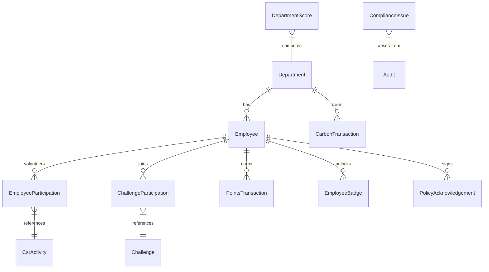

# 🌍 EcoSphere: Real-Time B2B ESG Management Platform

🔗 **Live Hackathon Demo**: [https://esg-management-platform-ashen.vercel.app/](https://esg-management-platform-ashen.vercel.app/)

**EcoSphere** is a premium, real-time Environmental, Social, and Governance (ESG) management platform designed to integrate sustainability directly into everyday B2B ERP operations. It transforms disconnected spreadsheet-based ESG metrics into automated ledger entries, gamified employee experiences, and data-driven executive forecasts.

---

## 🚀 Key Features & Modules

### 🍀 1. Environmental (Carbon Accounting)
*   **Automated Carbon Ledger**: Automatically tracks and converts operational logs (Expenses, Fleet travel, Manufacturing operations) into exact carbon equivalence using custom emission factors.
*   **Dynamic Emission Factors**: Allows configuration of custom emission coefficients (e.g., Grid Electricity, Diesel fuel, Domestic Flights) per activity unit.
*   **Sustainability Targets**: Monitors organizational progress toward Scope 1 & 2 reduction targets with real-time target calculators.

### 🤝 2. Social (CSR & Engagement)
*   **CSR Campaign Registry**: Registers volunteering drives and green office campaigns.
*   **Verified Employee Participation**: Requires verified photographic/file proof uploads (when evidence requirement toggle is active) before awarding XP.
*   **Volunteering Approvals**: Provides department heads with a dashboard to approve or reject employee volunteer records.

### ⚖️ 3. Governance (Policies & Audits)
*   **EsgPolicy Tracker**: Publishes governance policies (Code of Conduct, Privacy acts) and registers user digital acknowledgements in real time.
*   **Audit Registers**: Schedules internal/external audits for specific departments.
*   **Compliance Issue Board**: Tracks active compliance issues, flags overdue milestones, and assigns dedicated compliance owners.

### 🏆 4. Gamification (XP & Reward Shop)
*   **Eco Challenges**: Complete challenges (Draft $\to$ Active $\to$ Under Review $\to$ Completed lifecycle) to earn XP.
*   **Auto Badge Engine**: Monitors employee milestones and automatically issues badges (e.g., *Eco Starter*, *Sustainability Champion*) when thresholds are met.
*   **Redeemable Reward Shop**: Spend points to claim premium eco-rewards (e.g., *Bamboo Coffee Mugs*, *National Park Passes*) with automatic stock tracking.
*   **Live Leaderboard**: Real-time rank calculation across departments based on active sustainability XP.

### 🔮 5. ML ESG Trend Predictor (Hackathon Highlight!)
*   **Time-Series Forecasting**: Integrated a deterministic linear regression engine to fit historical score trajectories.
*   **Category Predictors**: Individually forecasts environmental, social, and governance score movements to identify exact downward-trending metrics.
*   **Org-Wide Aggregator**: Aggregates forecasts using a **headcount-weighted average** across all departments, applying the global ESG config weights for the unified organization index.

---

## 🛠️ Technology Stack

*   **Frontend**: React (Vite), React Query (TanStack), Axios, Recharts (Modern charts), Lucide icons, Premium HSL Tailored CSS Styling (Glassmorphism & animations).
*   **Backend**: Node.js, Express, JavaScript (ES Modules), Zod (Comprehensive request schema validation).
*   **Database**: PostgreSQL, Prisma v7 Client (Optimized Wasm-first database engine with Pg driver adapters).
*   **Machine Learning**: `regression` (Linear regression fitting library).
*   **Testing**: Custom CommonJS verification scripts for schemas and ML predictors.

---

## 📐 Data Model Architecture

The database is built on a clean relational schema modeled via Prisma:



---

## ⚡ Quickstart Setup

### Prerequisites
*   Node.js (v18+)
*   PostgreSQL running locally

### 1. Database Setup
1.  Initialize database schema and seed mock data:
    ```bash
    cd BACKEND
    # Create .env from template
    copy .env.example .env
    # Install dependencies
    npm install
    # Apply database migrations
    npx prisma db push
    # Populate comprehensive mock seed data (employees, scores, transactions)
    npx prisma db seed
    ```

### 2. Run the Backend API Server
```bash
cd BACKEND
npm run dev
# The API will run on http://localhost:5000
```

### 3. Run the Frontend React Application
```bash
cd FRONTEND
npm install
npm run dev
# The frontend will run on http://localhost:3000
```

---

## 🧪 Running Verification Test Suites

Verify validation layers and ML forecasting logic by executing our test suites:
```bash
cd BACKEND
# Test Zod schema validation rules
node scratch/test_validations.cjs
# Test ML linear regression trends and clamping math
node scratch/test_predictions_logic.js
```
