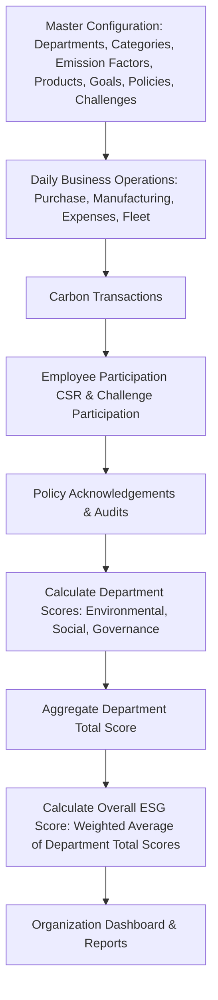

# EcoSphere: ESG Management Platform

EcoSphere is a comprehensive, enterprise-grade Environmental, Social, and Governance (ESG) Management Platform. It integrates sustainability metrics directly into day-to-day ERP operations, encourages employee participation through gamification, and provides meaningful real-time reports for management decision-making.

---

## 1. Background & Context

Environmental, Social, and Governance (ESG) criteria have transitioned from corporate social responsibility metrics to critical business indicators. Modern organizations must monitor carbon emissions, promote employee well-being, and maintain strict compliance with global governance standards.

While many traditional ERP systems excel at collecting financial and operational data, ESG reporting is historically manual, siloed, and retrospective. EcoSphere solves this by embedding ESG metrics directly into day-to-day business processes, transforming compliance into a dynamic, real-time organizational driver.

---

## 2. Challenge Statement

Build a unified ESG Management Platform that enables organizations to measure, manage, and improve their Environmental, Social, and Governance performance. The platform integrates operational data, employee participation, and compliance activities into a single intuitive dashboard while driving sustainable behavior through gamified mechanics.

---

## 3. Core Modules

### 🌿 Environmental (E)
- **Carbon Accounting & Tracking**: Automatic or manual calculation of emissions across departments based on ERP operations (Purchase, Manufacturing, Expenses, Fleet).
- **Emission Factors**: Configurable carbon values for various operational activities.
- **Sustainability Goals**: Department-level and organization-wide targets to reduce carbon footprint.

### 🤝 Social (S)
- **CSR Activities**: Corporate Social Responsibility initiatives and campaigns.
- **Employee Engagement**: CSR participation tracking, training completion logs, and diversity metrics.

### ⚖️ Governance (G)
- **ESG Policies**: Repository for governance, compliance, and environmental policies.
- **Audits & Compliance**: Tracking internal and external audits, creating compliance issues, assigning owners, and setting deadlines.

### 🎮 Gamification
- **Challenges**: Custom sustainability challenges (e.g., "Bike to Work Week", "Zero Waste Office") with full lifecycles.
- **XP, Badges & Rewards**: Reward points (XP) dynamically earned from activities, automatically unlocking achievements and redeemable incentives.
- **Leaderboards**: Friendly department-level and individual rankings to drive participation.

---

## 4. Data Model

### Master Data

| Model | Purpose | Key Fields |
| :--- | :--- | :--- |
| **Department** | Organizational hierarchy and ESG ownership | Name, Code, Head, Parent Department, Employee Count, Status |
| **Category** | Shared values across Social and Gamification modules | Name, Type (`CSR Activity` / `Challenge`), Status |
| **Emission Factor** | Carbon values used during calculations | Name, Activity Type, Carbon Coefficient, Unit of Measure, Status |
| **Product ESG Profile** | ESG profiles linked to manufactured/sold products | Product Name, Code, Embodied Carbon, Material Recyclability %, Status |
| **Environmental Goal** | Target metrics for sustainability goals | Goal Name, Target Value, Current Value, Start Date, End Date, Department, Status |
| **ESG Policy** | Governance policies requiring acknowledgment | Title, Document URL/Content, Effective Date, Review Frequency, Version |
| **Badge** | Employee achievements unlocked automatically | Name, Description, Unlock Rule (`Min XP` / `Completed Challenges`), Icon |
| **Reward** | Redeemable incentives | Name, Description, Points Required, Stock, Status |

### Transactional Data

| Model | Purpose | Key Fields |
| :--- | :--- | :--- |
| **Carbon Transaction** | Emissions recorded from ERP operations | Source Record (Purchase/Manufacturing/Expense/Fleet), Carbon Emitted (kg CO2e), Department, Transaction Date |
| **CSR Activity** | Social initiatives organized by the company | Title, Description, Organizer, Date, Status (`Planned` / `Active` / `Completed`) |
| **Employee Participation** | Tracks employee involvement in CSR Activities | Employee, Activity, Proof (Evidence File), Approval Status, Points Earned, Completion Date |
| **Challenge** | Sustainability challenges | Title, Category, Description, XP, Difficulty, Evidence Required (Bool), Deadline, Status (`Draft` / `Active` / `Under Review` / `Completed` / `Archived`) |
| **Challenge Participation** | Tracks employee progress within Challenges | Challenge, Employee, Progress %, Proof, Approval Status, XP Awarded |
| **Policy Acknowledgment** | Employee policy acceptance tracker | Employee, Policy, Acknowledged Date, Status (`Pending` / `Acknowledged`) |
| **Audit** | Governance audits conducted | Audit Name, Department, Auditor, Audit Date, Score, Findings, Status |
| **Compliance Issue** | Governance violations/issues raised | Audit Reference, Severity (`Low` / `Medium` / `High` / `Critical`), Description, Owner, Due Date, Status |
| **Department Score** | Aggregated performance scores per department | Department, Environmental Score, Social Score, Governance Score, Total Score, Calculation Date |

---

## 5. Business Workflow

*Note: The default weighting for the **Overall ESG Score** is **Environmental 40% / Social 30% / Governance 30%**, configurable per organization.*

---

## 6. Expected Features

### Environmental (E)
- Configure and manage **Emission Factors** for electricity, travel, logistics, etc.
- **Auto Emission Calculation** from linked transaction documents.
- Real-time carbon tracking by **Department**.
- Track and monitor completion of **Sustainability Goals**.

### Social (S)
- Manage and publish **CSR Activities**.
- Monitor and approve **Employee Participation** with optional evidence uploads.
- Analyze **Diversity Metrics** and team engagement.
- Record **ESG/Compliance Training** completion.

### Governance (G)
- Manage **ESG Policies** and capture **Policy Acknowledgements**.
- Schedule and log **Audits**.
- Log, assign, and track **Compliance Issues** to resolution.

### Gamification
- **Challenge Lifecycle Management**: Transition challenges through `Draft` ➔ `Active` ➔ `Under Review` ➔ `Completed` / `Archived`.
- **Badges Engine**: Automatically assign badges when threshold rules are met.
- **Reward Catalog**: Point-based incentive redemption system.
- **Leaderboards**: Departmental and individual rankings based on accumulated XP.

### Settings & Administration
- Department and Category administration.
- Weights configuration (E/S/G ratio).
- **Notification Settings**: Toggle channels (in-app, email) for compliance, badges, and approvals.

---

## 7. Reports & Analytics

The platform generates standard templates and features a **Custom Report Builder** (allowing filters to be combined and results exported to **PDF / Excel / CSV**).

### Standard Reports
1. **Environmental Report**: Emission patterns, goal progress, and carbon hotspots.
2. **Social Report**: Participation rates, diversity statistics, and training compliance.
3. **Governance Report**: Open compliance issues, policy acknowledgment rates, and audit logs.
4. **ESG Summary Report**: High-level scores and comparative department rankings.

### Report Filters
- Department
- Date Range
- Module
- Employee
- Challenge
- ESG Category

---

## 8. Core Configurations & Business Rules

1. **Reward Redemption**: Employees can redeem earned Points/XP for a Reward from the catalog, subject to stock availability. Redeeming a Reward deducts the corresponding Points from the employee's balance.
2. **Notification System**: The platform sends notifications (in-app and/or email) for at least: new compliance issue raised, CSR/Challenge approval decisions, policy acknowledgement reminders, and badge unlocks. Configurable via Settings → Notification Settings.
3. **Auto Emission Calculation**: When enabled (Settings toggle), Carbon Transactions are calculated automatically from linked Purchase/Manufacturing/Expense/Fleet records using the relevant Emission Factor - no manual entry required.
4. **Evidence Requirement**: When enabled (Settings toggle), CSR Activity participation cannot be marked Approved without an attached proof file.
5. **Badge Auto-Award**: When enabled (Settings toggle), a Badge is automatically assigned to an employee the moment their XP, completed-challenge count, or other tracked metric satisfies that Badge's Unlock Rule - no manual admin action required.
6. **Compliance Issue Ownership**: Every Compliance Issue must have an assigned Owner and a Due Date; issues that pass their Due Date while still Open should be flagged (feeds the Notification System above).

---

## 9. UI/UX Design Mockups

Visual wireframes and mockup flows can be reviewed here:
👉 [EcoSphere Excalidraw Mockups](https://link.excalidraw.com/l/65VNwvy7c4X/2m6lz9Ln4)
# ESG-Management-Platform

# ESG-Management-Platform

